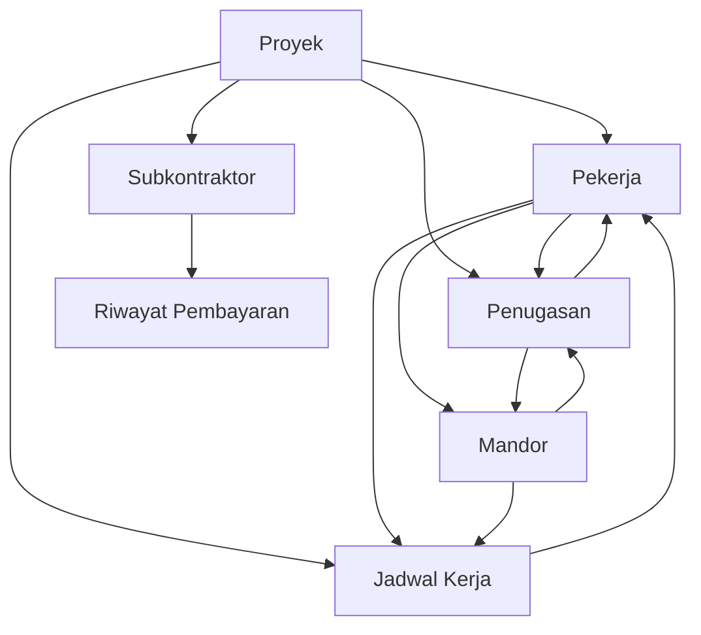

# API Usage Documentation - Tenaga Kerja & Subkontraktor System

## Overview

Dokumentasi ini menjelaskan cara penggunaan API untuk sistem Tenaga Kerja & Subkontraktor dengan 5 content types utama. Semua endpoint menggunakan format `/content-manager/collection-types/` untuk akses melalui Strapi Admin Panel.

### Implementation Notes

Backend telah diimplementasikan dengan schema berikut:

- ✅ **Pekerja** - Content type baru untuk tenaga kerja konstruksi
- ✅ **Subkontraktor** - Content type baru untuk manajemen subkontraktor
- ✅ **Jadwal Kerja** - Content type baru untuk penjadwalan kerja harian
- ✅ **Penugasan** - Content type baru untuk assignment pekerjaan
- ✅ **Riwayat Pembayaran** - Content type baru untuk tracking pembayaran subkontraktor

**Schema Changes:**

- Field `status` pada project-worker diubah menjadi `status_pekerja` untuk konsistensi
- Dokumen media dipisah menjadi field individual (`foto`, `ktp`, `kontrak`, dll) plus komponen `dokumen` untuk dokumen tambahan
- Kontak subkontraktor menggunakan komponen khusus `kontak-subkontraktor` yang menyertakan `pic_name`
- Semua content type menggunakan `draftAndPublish: false` sesuai permintaan

## Content Types API Endpoints

### 1. Pekerja API (`api::pekerja.pekerja`)

#### Base URL

```
/content-manager/collection-types/api::pekerja.pekerja
```

#### Endpoints

| Method | Endpoint                                                     | Description       |
| ------ | ------------------------------------------------------------ | ----------------- |
| GET    | `/content-manager/collection-types/api::pekerja.pekerja`     | Get all workers   |
| GET    | `/content-manager/collection-types/api::pekerja.pekerja/:id` | Get worker by ID  |
| POST   | `/content-manager/collection-types/api::pekerja.pekerja`     | Create new worker |
| PUT    | `/content-manager/collection-types/api::pekerja.pekerja/:id` | Update worker     |
| DELETE | `/content-manager/collection-types/api::pekerja.pekerja/:id` | Delete worker     |

#### Data Structure

```json
{
  "nama_lengkap": "string", // Required
  "nik": "string", // Required, unique
  "posisi": "string", // Required (Mandor, Tukang Batu, Tukang Kayu, Tukang Cat, Tukang Listrik, dll)
  "proyek": "relation", // Many-to-one to projects
  "kontak": {
    "telepon": "string", // Required
    "email": "string" // Optional
  },
  "tanggal_mulai": "date", // Required
  "status_pekerja": "enumeration", // Required (Aktif, Nonaktif, Cuti)
  "alamat": "text",
  "keahlian": "json", // Array of skills
  "upah_harian": "decimal",
  "foto": "media", // Optional
  "ktp": "media", // Optional
  "kontrak": "media", // Optional
  "dokumen": "component" // komponen.dokumen for additional documents
}
```

#### Request Examples

**Create Worker:**

```json
POST /content-manager/collection-types/api::pekerja.pekerja
Content-Type: application/json

{
  "nama_lengkap": "Budi Santoso",
  "nik": "3201012345678901",
  "posisi": "Mandor",
  "proyek": 1,
  "kontak": {
    "telepon": "081234567890",
    "email": "budi.santoso@example.com"
  },
  "tanggal_mulai": "2023-01-15",
  "status_pekerja": "Aktif",
  "alamat": "Jl. Merdeka No. 123, Jakarta",
  "keahlian": ["Supervisi", "Manajemen Tim", "Quality Control"],
  "upah_harian": 150000
}
```

**Update Worker Status:**

```json
PUT /content-manager/collection-types/api::pekerja.pekerja/1
Content-Type: application/json

{
  "status_pekerja": "Nonaktif",
  "tanggal_berakhir": "2023-12-31"
}
```

**Get Workers with Relations:**

```json
GET /content-manager/collection-types/api::pekerja.pekerja?populate[proyek][fields][0]=project_name&populate[jadwal_kerjas]=*&populate[penugasans]=*
```

---

### 2. Subkontraktor API (`api::subkontraktor.subkontraktor`)

#### Base URL

```
/content-manager/collection-types/api::subkontraktor.subkontraktor
```

#### Endpoints

| Method | Endpoint                                                                 | Description              |
| ------ | ------------------------------------------------------------------------ | ------------------------ |
| GET    | `/content-manager/collection-types/api::subkontraktor.subkontraktor`     | Get all subcontractors   |
| GET    | `/content-manager/collection-types/api::subkontraktor.subkontraktor/:id` | Get subcontractor by ID  |
| POST   | `/content-manager/collection-types/api::subkontraktor.subkontraktor`     | Create new subcontractor |
| PUT    | `/content-manager/collection-types/api::subkontraktor.subkontraktor/:id` | Update subcontractor     |
| DELETE | `/content-manager/collection-types/api::subkontraktor.subkontraktor/:id` | Delete subcontractor     |

#### Data Structure

```json
{
  "nama_perusahaan": "string", // Required
  "jenis_pekerjaan": "string", // Required (Pekerjaan Struktur, Pekerjaan Atap, Instalasi Listrik, dll)
  "proyek": "relation", // Many-to-one to projects
  "kontak": {
    "pic_name": "string", // Person in charge - Required
    "telepon": "string", // Required
    "email": "string" // Optional
  },
  "alamat": "text",
  "nilai_kontrak": "decimal", // Required
  "progress_pekerjaan": "integer", // 0-100 percentage
  "status_kontrak": "enumeration", // Aktif, Selesai, Dibatalkan
  "tanggal_mulai": "date",
  "tanggal_selesai_estimasi": "date",
  "tanggal_selesai_aktual": "date",
  "pembayaran": {
    "total_dibayar": "decimal",
    "outstanding": "decimal",
    "jadwal_pembayaran": "json"
  },
  "kontrak_dokumen": "media", // Contract document
  "surat_penawaran": "media", // Offer letter
  "dokumen_pendukung": "media" // Supporting documents (multiple)
}
```

#### Request Examples

**Create Subcontractor:**

```json
POST /content-manager/collection-types/api::subkontraktor.subkontraktor
Content-Type: application/json

{
  "nama_perusahaan": "CV Karya Beton",
  "jenis_pekerjaan": "Pekerjaan Struktur",
  "proyek": 1,
  "kontak": {
    "pic_name": "Ahmad Subandi",
    "telepon": "021-12345678",
    "email": "ahmad@karyabeton.com"
  },
  "alamat": "Jl. Industri No. 45, Bekasi",
  "nilai_kontrak": 245000000,
  "progress_pekerjaan": 0,
  "status_kontrak": "Aktif",
  "tanggal_mulai": "2023-01-20",
  "tanggal_selesai_estimasi": "2023-03-20",
  "pembayaran": {
    "total_dibayar": 0,
    "outstanding": 245000000,
    "jadwal_pembayaran": [
      {
        "termin": 1,
        "persentase": 30,
        "nilai": 73500000,
        "tanggal_jatuh_tempo": "2023-02-01",
        "status": "Pending"
      },
      {
        "termin": 2,
        "persentase": 40,
        "nilai": 98000000,
        "tanggal_jatuh_tempo": "2023-02-20",
        "status": "Pending"
      },
      {
        "termin": 3,
        "persentase": 30,
        "nilai": 73500000,
        "tanggal_jatuh_tempo": "2023-03-20",
        "status": "Pending"
      }
    ]
  }
}
```

**Update Progress and Payment:**

```json
PUT /content-manager/collection-types/api::subkontraktor.subkontraktor/1
Content-Type: application/json

{
  "progress_pekerjaan": 65,
  "pembayaran": {
    "total_dibayar": 171500000,
    "outstanding": 73500000,
    "jadwal_pembayaran": [
      {
        "termin": 1,
        "persentase": 30,
        "nilai": 73500000,
        "tanggal_jatuh_tempo": "2023-02-01",
        "status": "Lunas",
        "tanggal_pembayaran": "2023-01-30"
      },
      {
        "termin": 2,
        "persentase": 40,
        "nilai": 98000000,
        "tanggal_jatuh_tempo": "2023-02-20",
        "status": "Lunas",
        "tanggal_pembayaran": "2023-02-18"
      },
      {
        "termin": 3,
        "persentase": 30,
        "nilai": 73500000,
        "tanggal_jatuh_tempo": "2023-03-20",
        "status": "Pending"
      }
    ]
  }
}
```

---

### 3. Jadwal Kerja API (`api::jadwal-kerja.jadwal-kerja`)

#### Base URL

```
/content-manager/collection-types/api::jadwal-kerja.jadwal-kerja
```

#### Endpoints

| Method | Endpoint                                                               | Description         |
| ------ | ---------------------------------------------------------------------- | ------------------- |
| GET    | `/content-manager/collection-types/api::jadwal-kerja.jadwal-kerja`     | Get all schedules   |
| GET    | `/content-manager/collection-types/api::jadwal-kerja.jadwal-kerja/:id` | Get schedule by ID  |
| POST   | `/content-manager/collection-types/api::jadwal-kerja.jadwal-kerja`     | Create new schedule |
| PUT    | `/content-manager/collection-types/api::jadwal-kerja.jadwal-kerja/:id` | Update schedule     |
| DELETE | `/content-manager/collection-types/api::jadwal-kerja.jadwal-kerja/:id` | Delete schedule     |

#### Data Structure

```json
{
  "tanggal": "date", // Required
  "shift": "enumeration", // Pagi (07:00-15:00), Siang (08:00-16:00), Lembur (16:00-20:00)
  "proyek": "relation", // Many-to-one to projects
  "lokasi_kerja": "string", // e.g., "Griya Indah - Blok A"
  "pekerjas": "relation", // Many-to-many to pekerja
  "mandor": "relation", // Many-to-one to pekerja (where posisi = "Mandor")
  "jam_mulai": "time",
  "jam_selesai": "time",
  "target_pekerjaan": "text",
  "status_jadwal": "enumeration", // Dijadwalkan, Berlangsung, Selesai, Dibatalkan
  "jumlah_pekerja": "integer",
  "kehadiran": "json", // Array of attendance records
  "catatan": "text"
}
```

#### Request Examples

**Create Schedule:**

```json
POST /content-manager/collection-types/api::jadwal-kerja.jadwal-kerja
Content-Type: application/json

{
  "tanggal": "2023-10-24",
  "shift": "Pagi",
  "proyek": 1,
  "lokasi_kerja": "Griya Indah - Blok A",
  "pekerjas": [2, 3, 4, 5, 6, 7],
  "mandor": 1,
  "jam_mulai": "07:00",
  "jam_selesai": "15:00",
  "target_pekerjaan": "Pengecoran Kolom",
  "status_jadwal": "Dijadwalkan",
  "jumlah_pekerja": 6,
  "kehadiran": [],
  "catatan": "Persiapkan alat cor dan material semen"
}
```

**Update Attendance:**

```json
PUT /content-manager/collection-types/api::jadwal-kerja.jadwal-kerja/1
Content-Type: application/json

{
  "status_jadwal": "Berlangsung",
  "kehadiran": [
    {
      "pekerja_id": 1,
      "nama": "Budi Santoso",
      "status": "Hadir",
      "jam_masuk": "07:00",
      "jam_keluar": null,
      "catatan": null
    },
    {
      "pekerja_id": 2,
      "nama": "Agus Setiawan",
      "status": "Hadir",
      "jam_masuk": "07:05",
      "jam_keluar": null,
      "catatan": "Terlambat 5 menit"
    },
    {
      "pekerja_id": 3,
      "nama": "Joko Purnomo",
      "status": "Sakit",
      "jam_masuk": null,
      "jam_keluar": null,
      "catatan": "Izin sakit dengan surat dokter"
    }
  ]
}
```

---

### 4. Penugasan API (`api::penugasan.penugasan`)

#### Base URL

```
/content-manager/collection-types/api::penugasan.penugasan
```

#### Endpoints

| Method | Endpoint                                                         | Description           |
| ------ | ---------------------------------------------------------------- | --------------------- |
| GET    | `/content-manager/collection-types/api::penugasan.penugasan`     | Get all assignments   |
| GET    | `/content-manager/collection-types/api::penugasan.penugasan/:id` | Get assignment by ID  |
| POST   | `/content-manager/collection-types/api::penugasan.penugasan`     | Create new assignment |
| PUT    | `/content-manager/collection-types/api::penugasan.penugasan/:id` | Update assignment     |
| DELETE | `/content-manager/collection-types/api::penugasan.penugasan/:id` | Delete assignment     |

#### Data Structure

```json
{
  "nama_tugas": "string", // Required
  "deskripsi": "text",
  "proyek": "relation", // Many-to-one to projects
  "lokasi": "string", // e.g., "Griya Indah - Blok A"
  "penanggung_jawab": "relation", // Many-to-one to pekerja (Mandor)
  "pekerjas": "relation", // Many-to-many to pekerja
  "tanggal_mulai": "date", // Required
  "tanggal_selesai": "date", // Required
  "status_tugas": "enumeration", // Belum Mulai, On Progress, Selesai, Dibatalkan
  "progress_persentase": "integer", // 0-100
  "prioritas": "enumeration", // Rendah, Sedang, Tinggi, Urgent
  "estimasi_durasi": "integer", // in days
  "jumlah_pekerja": "integer",
  "materials_required": "json", // Array of required materials
  "target_output": "text",
  "actual_output": "text",
  "catatan": "text"
}
```

#### Request Examples

**Create Assignment:**

```json
POST /content-manager/collection-types/api::penugasan.penugasan
Content-Type: application/json

{
  "nama_tugas": "Pengecoran Kolom",
  "deskripsi": "Pengecoran kolom lantai 1 untuk unit 1-5",
  "proyek": 1,
  "lokasi": "Griya Indah - Blok A",
  "penanggung_jawab": 1,
  "pekerjas": [2, 3, 4, 5, 6],
  "tanggal_mulai": "2023-10-23",
  "tanggal_selesai": "2023-10-24",
  "status_tugas": "Belum Mulai",
  "progress_persentase": 0,
  "prioritas": "Tinggi",
  "estimasi_durasi": 2,
  "jumlah_pekerja": 6,
  "materials_required": [
    {
      "material": "Semen Portland",
      "quantity": 50,
      "unit": "Sak"
    },
    {
      "material": "Pasir",
      "quantity": 10,
      "unit": "m³"
    },
    {
      "material": "Kerikil",
      "quantity": 15,
      "unit": "m³"
    }
  ],
  "target_output": "5 kolom selesai dicor dengan kualitas sesuai standar",
  "catatan": "Pastikan cuaca tidak hujan saat pengecoran"
}
```

**Update Progress:**

```json
PUT /content-manager/collection-types/api::penugasan.penugasan/1
Content-Type: application/json

{
  "status_tugas": "On Progress",
  "progress_persentase": 60,
  "actual_output": "3 kolom telah selesai dicor, 2 kolom dalam proses",
  "catatan": "Progress sesuai target, cuaca mendukung"
}
```

---

### 5. Riwayat Pembayaran API (`api::riwayat-pembayaran.riwayat-pembayaran`)

#### Base URL

```
/content-manager/collection-types/api::riwayat-pembayaran.riwayat-pembayaran
```

#### Endpoints

| Method | Endpoint                                                                           | Description               |
| ------ | ---------------------------------------------------------------------------------- | ------------------------- |
| GET    | `/content-manager/collection-types/api::riwayat-pembayaran.riwayat-pembayaran`     | Get all payment history   |
| GET    | `/content-manager/collection-types/api::riwayat-pembayaran.riwayat-pembayaran/:id` | Get payment by ID         |
| POST   | `/content-manager/collection-types/api::riwayat-pembayaran.riwayat-pembayaran`     | Create new payment record |
| PUT    | `/content-manager/collection-types/api::riwayat-pembayaran.riwayat-pembayaran/:id` | Update payment record     |
| DELETE | `/content-manager/collection-types/api::riwayat-pembayaran.riwayat-pembayaran/:id` | Delete payment record     |

#### Data Structure

```json
{
  "subkontraktor": "relation", // Many-to-one to subkontraktor
  "jumlah_pembayaran": "decimal", // Required
  "tanggal_pembayaran": "date", // Required
  "metode_pembayaran": "enumeration", // Transfer Bank, Tunai, Cek
  "nomor_referensi": "string", // Transaction reference number
  "termin": "integer", // Payment term number
  "deskripsi": "text",
  "status_pembayaran": "enumeration", // Pending, Berhasil, Gagal
  "bukti_pembayaran": "media", // Payment proof document
  "catatan": "text",
  "dibuat_oleh": "relation" // Many-to-one to admin users
}
```

#### Request Examples

**Create Payment Record:**

```json
POST /content-manager/collection-types/api::riwayat-pembayaran.riwayat-pembayaran
Content-Type: application/json

{
  "subkontraktor": 1,
  "jumlah_pembayaran": 73500000,
  "tanggal_pembayaran": "2023-01-30",
  "metode_pembayaran": "Transfer Bank",
  "nomor_referensi": "TRF20230130001",
  "termin": 1,
  "deskripsi": "Termin 1 (30%) - Pekerjaan Struktur CV Karya Beton",
  "status_pembayaran": "Berhasil",
  "catatan": "Pembayaran sesuai jadwal kontrak",
  "dibuat_oleh": 1
}
```

**Update Payment Status:**

```json
PUT /content-manager/collection-types/api::riwayat-pembayaran.riwayat-pembayaran/1
Content-Type: application/json

{
  "status_pembayaran": "Berhasil",
  "nomor_referensi": "TRF20230130001",
  "catatan": "Transfer berhasil dikonfirmasi bank"
}
```

## Common Query Parameters

### Filtering Examples

**Get Workers by Project:**

```
GET /content-manager/collection-types/api::pekerja.pekerja?filters[proyek][id][$eq]=1
```

**Get Active Workers:**

```
GET /content-manager/collection-types/api::pekerja.pekerja?filters[status_pekerja][$eq]=Aktif
```

**Get Schedules by Date Range:**

```
GET /content-manager/collection-types/api::jadwal-kerja.jadwal-kerja?filters[tanggal][$gte]=2023-10-23&filters[tanggal][$lte]=2023-10-29
```

**Get Subcontractors by Status:**

```
GET /content-manager/collection-types/api::subkontraktor.subkontraktor?filters[status_kontrak][$eq]=Aktif
```

### Population Examples

**Get Workers with Project and Assignments:**

```
GET /content-manager/collection-types/api::pekerja.pekerja?populate[proyek][fields][0]=project_name&populate[penugasans][fields][0]=nama_tugas&populate[penugasans][fields][1]=status_tugas
```

**Get Schedules with Workers and Project:**

```
GET /content-manager/collection-types/api::jadwal-kerja.jadwal-kerja?populate[pekerjas][fields][0]=nama_lengkap&populate[pekerjas][fields][1]=posisi&populate[proyek][fields][0]=project_name
```

**Get Subcontractors with Payment History:**

```
GET /content-manager/collection-types/api::subkontraktor.subkontraktor?populate[riwayat_pembayarans]=*
```

### Sorting Examples

**Sort Workers by Name:**

```
GET /content-manager/collection-types/api::pekerja.pekerja?sort[0]=nama_lengkap:asc
```

**Sort Assignments by Priority and Date:**

```
GET /content-manager/collection-types/api::penugasan.penugasan?sort[0]=prioritas:desc&sort[1]=tanggal_mulai:asc
```

**Sort Payment History by Date (Newest First):**

```
GET /content-manager/collection-types/api::riwayat-pembayaran.riwayat-pembayaran?sort[0]=tanggal_pembayaran:desc
```

## Response Format

All APIs return data in standard Strapi format:

```json
{
  "data": [
    {
      "id": 1,
      "documentId": "abc123",
      "nama_lengkap": "Budi Santoso",
      "nik": "3201012345678901",
      "posisi": "Mandor",
      "status_pekerja": "Aktif",
      "createdAt": "2023-10-20T10:00:00.000Z",
      "updatedAt": "2023-10-20T10:00:00.000Z",
      "publishedAt": "2023-10-20T10:00:00.000Z"
    }
  ],
  "meta": {
    "pagination": {
      "page": 1,
      "pageSize": 25,
      "pageCount": 1,
      "total": 1
    }
  }
}
```

## Relationships Overview



## Integration Notes

1. **Authentication**: All endpoints require Strapi Admin API authentication
2. **Permissions**: Ensure proper role-based access control is configured
3. **File Uploads**: Use Strapi's upload plugin for document attachments
4. **Validation**: Implement client-side validation based on data structure requirements
5. **Error Handling**: Handle standard HTTP status codes (400, 401, 403, 404, 500)
6. **Performance**: Use population and filtering strategically to optimize queries
7. **Real-time Updates**: Consider implementing webhooks for real-time attendance and progress updates
